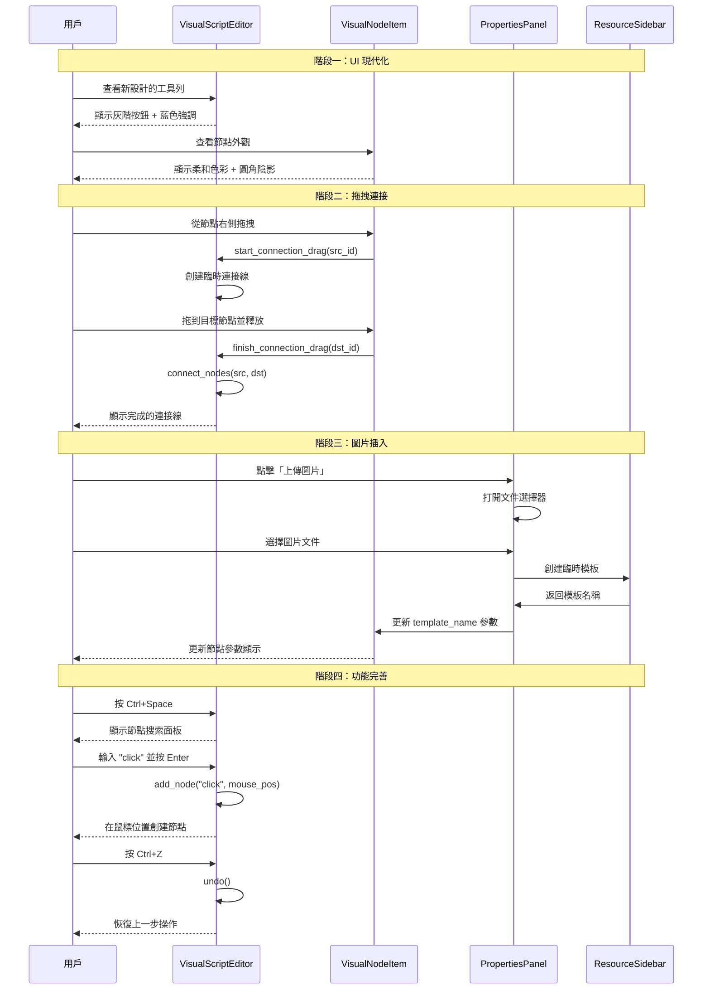

I have created the following plan after thorough exploration and analysis of the codebase. Follow the below plan verbatim. Trust the files and references. Do not re-verify what's written in the plan. Explore only when absolutely necessary. First implement all the proposed file changes and then I'll review all the changes together at the end.

## 觀察重點

根據提供的截圖和代碼分析，目前系統是基於 PySide6 的視覺化腳本編輯器，用於遊戲自動化。主要問題包括：連接模式需要切換按鈕且操作不直觀、工具列按鈕使用鮮豔的 Material Design 色彩（#2196F3、#FF9800 等）、右下角出現不明圓點（可能是 ConnectionItem 渲染問題）、find_image 節點僅支援模板名稱引用而非直接圖片插入。現有架構使用 `VisualScriptEditor`、`VisualNodeItem`、`EdgeItem` 和 `ConnectionItem` 類別來實現節點圖編輯。屬性面板圖片預覽區域存在放大問題，已移除相關預覽功能以簡化介面。

## 實施方法

採用漸進式改進策略，優先解決 UI/UX 痛點，再擴展功能完整性。連接機制改為拖拽式（從節點直接拖到目標節點），移除連接模式切換按鈕。按鈕設計改用現代扁平化單色系（灰階 + 藍色強調），參考 VS Code/Figma 風格。修復右下角圓點問題（調整 ConnectionItem 可見性或移除）。新增圖片直接插入功能（支援拖放、剪貼簿、文件選擇器），將圖片嵌入節點參數或自動創建臨時模板。優化整體工作流程，增強節點參數編輯體驗，添加快捷鍵、撤銷/重做、節點搜索等專業功能，避免不必要的預覽視圖放大問題。

---

## 實施步驟

### 階段一：UI 現代化與連接體驗改進

#### 1. 按鈕設計現代化

**目標文件：** `file:game_automation/ui/visual_script_editor.py`

- 移除工具列按鈕的彩色背景（第 367-412 行）
- 採用統一的灰階配色方案：
  - 主要按鈕：`#f0f0f0` 背景，`#333333` 文字
  - 懸停狀態：`#e0e0e0` 背景
  - 執行按鈕：保留藍色強調 `#0078d4`（Microsoft Fluent 風格）
  - 按鈕圓角改為 `6px`，增加陰影 `box-shadow: 0 1px 3px rgba(0,0,0,0.12)`
- 移除按鈕上的 emoji 圖標，改用純文字或 SVG 圖標
- 調整按鈕間距為 `8px`，統一高度為 `32px`

**目標文件：** `file:game_automation/ui/themes.py`

- 更新全局主題樣式，確保與新按鈕風格一致
- 添加 `:focus` 狀態樣式（藍色邊框 `#0078d4`）

#### 2. 節點視覺設計優化

**目標文件：** `file:game_automation/ui/visual_script_editor.py` 中的 `VisualNodeItem` 類別（第 10-135 行）

- 保留節點類型顏色區分，但降低飽和度（將當前 Material Design 色彩轉為柔和色調）
- 移除漸變背景（第 59-61 行），改用純色 + 微妙陰影
- 增加節點邊框圓角至 `8px`
- 選中狀態改用藍色邊框（`2px solid #0078d4`）而非整體變暗
- 優化文字排版：標題使用 `font-weight: 600`，參數文字使用 `font-size: 11px`

#### 3. 連接線視覺改進

**目標文件：** `file:game_automation/ui/visual_script_editor.py` 中的 `EdgeItem` 類別（第 167-211 行）

- 將連接線顏色改為 `#999999`，寬度改為 `1.5px`
- 選中節點時，相關連接線高亮為 `#0078d4`，寬度 `2.5px`
- 添加箭頭指示方向（在 `_update_path` 方法中繪製三角形箭頭）

#### 4. 修復右下角圓點問題

**目標文件：** `file:game_automation/ui/visual_script_editor.py`

- 檢查 `ConnectionItem` 類別（第 159-165 行）的使用場景
- 方案 A：將 ConnectionItem 設為不可見（`setVisible(False)`），僅用於邏輯判斷
- 方案 B：移除 ConnectionItem，改用節點邊界框作為連接熱區
- 在 `load_script` 方法（第 467-485 行）中，將 ConnectionItem 的創建改為隱藏或移除

---

### 階段二：拖拽式連接機制

#### 5. 實現節點拖拽連接

**目標文件：** `file:game_automation/ui/visual_script_editor.py`

**在 `VisualNodeItem` 類別中添加：**

- 新增 `mousePressEvent` 覆寫：檢測是否點擊節點右側連接區域（寬度 20px）
- 新增 `mouseMoveEvent` 覆寫：當拖拽開始時，創建臨時 `EdgeItem` 跟隨鼠標
- 新增 `mouseReleaseEvent` 覆寫：檢測釋放位置是否在其他節點上，若是則調用 `editor.connect_nodes()`

**在 `VisualScriptEditor` 類別中添加：**

- 新增 `_temp_connection_edge` 屬性，用於存儲拖拽中的臨時連接線
- 新增 `start_connection_drag(src_node_id)` 方法：初始化拖拽連接
- 新增 `update_connection_drag(mouse_pos)` 方法：更新臨時連接線終點
- 新增 `finish_connection_drag(dst_node_id)` 方法：完成連接並清理臨時線
- 移除 `_connect_mode` 和 `_connect_mode_btn` 相關代碼（第 349、417-432 行）

**視覺反饋：**

- 拖拽時，臨時連接線使用虛線樣式（`Qt.DashLine`）
- 鼠標懸停在可連接節點上時，節點邊框高亮為綠色 `#4caf50`
- 無法連接時（如已有連接），顯示紅色邊框 `#f44336`

---

### 階段三：圖片直接插入功能

#### 6. 節點支援圖片嵌入

**目標文件：** `file:game_automation/core/actions.py`

- 在 `VisualNode` 的 `params` 中添加新欄位支援：
  - `image_data`: Base64 編碼的圖片數據（用於嵌入小圖片）
  - `image_path`: 臨時圖片路徑（用於大圖片）

**目標文件：** `file:game_automation/ui/main_window.py` 中的 `PropertiesPanel` 類別（第 22-225 行）

- 在 `set_node` 方法的 `find_image` 分支（約第 150-187 行）中添加：
  - 新增「上傳圖片」按鈕，點擊後打開 `QFileDialog` 選擇圖片
  - 新增「從剪貼簿粘貼」按鈕，讀取 `QClipboard` 中的圖片數據
  - 當圖片插入時，自動生成唯一模板名稱（如 `inline_image_<timestamp>`）並保存到臨時目錄
  - 更新節點 `params['template_name']` 為生成的模板名稱

#### 7. 拖放圖片到節點

**目標文件：** `file:game_automation/ui/visual_script_editor.py` 中的 `VisualNodeItem` 類別

- 啟用拖放支援：`setAcceptDrops(True)`
- 覆寫 `dragEnterEvent`：檢查拖入數據是否為圖片文件或圖片數據
- 覆寫 `dropEvent`：
  - 讀取圖片數據
  - 保存到臨時目錄（`BASE_DIR/temp_templates/`）
  - 自動創建模板並添加到 `resources.json`
  - 更新節點參數 `template_name`
  - 發射 `nodeParamsChanged` 信號

**目標文件：** `file:game_automation/ui/visual_script_editor.py` 中的 `ScriptGraphicsView` 類別

- 啟用視圖級別的拖放支援，將圖片拖放事件轉發到對應節點

---

### 階段四：功能完善與工作流程優化

#### 8. 節點快速創建與搜索

**目標文件：** `file:game_automation/ui/visual_script_editor.py`

- 添加快捷鍵支援：
  - `Ctrl+Space`：打開節點搜索面板（`QLineEdit` + `QListWidget`）
  - 輸入節點類型名稱（如 "click"、"點擊"）快速篩選
  - `Enter` 鍵在當前鼠標位置創建節點
- 右鍵菜單增強：
  - 在空白區域右鍵顯示「添加節點」子菜單
  - 列出所有節點類型，點擊即在右鍵位置創建

#### 9. 撤銷/重做功能

**目標文件：** `file:game_automation/ui/visual_script_editor.py`

- 新增 `_history_stack` 和 `_history_index` 屬性
- 在 `_emit_changed` 方法中記錄腳本狀態快照（JSON 序列化）
- 添加 `undo()` 和 `redo()` 方法，恢復歷史狀態
- 綁定快捷鍵：`Ctrl+Z` 撤銷，`Ctrl+Shift+Z` 重做
- 在工具列添加撤銷/重做按鈕

#### 10. 節點參數快速編輯

**目標文件：** `file:game_automation/ui/main_window.py` 中的 `PropertiesPanel` 類別

- 為常用參數添加快捷輸入：
  - `label` 參數：添加自動完成下拉框（從 `TARGET_DEFINITIONS` 和 `resources.json` 讀取）
  - `seconds` 參數：添加滑桿（0-10 秒，步進 0.1）
  - `confidence` 參數：添加滑桿（0.5-1.0，步進 0.05）
- 添加參數驗證：輸入非法值時顯示紅色邊框和錯誤提示

#### 11. 節點組與註釋

**目標文件：** `file:game_automation/core/actions.py`

- 在 `VisualNode` 中添加 `comment` 欄位（字符串）
- 在 `VisualScript` 中添加 `groups` 欄位（節點分組信息）

**目標文件：** `file:game_automation/ui/visual_script_editor.py`

- 新增 `CommentItem` 類別（繼承 `QGraphicsTextItem`）：
  - 可編輯的多行文字框
  - 半透明黃色背景
  - 可調整大小
- 在工具列添加「添加註釋」按鈕
- 節點右鍵菜單添加「編輯註釋」選項

#### 12. 執行狀態可視化

**目標文件：** `file:game_automation/ui/visual_script_editor.py`

- 在 `VisualNodeItem` 中添加執行狀態指示：
  - 執行中：節點邊框動畫（藍色脈衝效果）
  - 執行成功：綠色勾選圖標（右上角）
  - 執行失敗：紅色叉號圖標（右上角）
- 在 `highlight_active_node` 方法（第 615-628 行）中添加動畫效果

**目標文件：** `file:game_automation/ui/main_window.py`

- 在 `ScriptRunnerThread` 類別（第 881-903 行）中添加節點執行狀態信號
- 在 `MainWindow` 中連接信號，實時更新節點視覺狀態

---

### 階段五：高級功能與性能優化

#### 13. 節點模板與代碼片段

**目標文件：** `file:game_automation/ui/widgets.py`

- 在 `ResourceSidebar` 中添加「節點模板」標籤頁
- 支援保存常用節點組合為模板（多個節點 + 連接）
- 拖拽模板到編輯器即可實例化

#### 14. 性能優化

**目標文件：** `file:game_automation/ui/visual_script_editor.py`

- 在 `ScriptGraphicsView` 中啟用視口裁剪：
  - 僅渲染可見區域內的節點和連接線
  - 使用 `QGraphicsScene.setItemIndexMethod(QGraphicsScene.NoIndex)` 優化大型腳本
- 在 `_update_all_edges` 方法（第 669-674 行）中添加批量更新優化：
  - 使用 `scene.setUpdatesEnabled(False)` 暫停更新
  - 批量更新所有邊後再啟用更新

---

## 實施流程圖

---

## 關鍵文件與符號對照表

| 功能模塊 | 主要文件 | 關鍵類別/方法 |
|---------|---------|--------------|
| 節點視覺 | `file:game_automation/ui/visual_script_editor.py` | `VisualNodeItem`, `_colors`, `_icons` |
| 連接機制 | `file:game_automation/ui/visual_script_editor.py` | `ScriptGraphicsView.mousePressEvent`, `connect_nodes` |
| 按鈕樣式 | `file:game_automation/ui/visual_script_editor.py` | `_build_controls` (第 357-453 行) |
| 主題配色 | `file:game_automation/ui/themes.py` | `LIGHT_QSS` |
| 屬性面板 | `file:game_automation/ui/main_window.py` | `PropertiesPanel.set_node` |
| 圖片管理 | `file:game_automation/ui/widgets.py` | `ResourceSidebar._on_new_template` |
| 數據模型 | `file:game_automation/core/actions.py` | `VisualNode`, `VisualScript` |
| 連接線渲染 | `file:game_automation/ui/visual_script_editor.py` | `EdgeItem._update_path` |

---

## 用戶體驗改進總結

| 改進項目 | 當前問題 | 解決方案 | 預期效果 |
|---------|---------|---------|---------|
| 連接操作 | 需切換模式，點擊小圓點 | 直接從節點拖拽到目標節點 | 操作步驟減少 50%，符合直覺 |
| 按鈕設計 | 彩色過於鮮豔，不專業 | 灰階 + 藍色強調，扁平化 | 視覺疲勞降低，專業感提升 |
| 圖片插入 | 僅支援模板名稱引用 | 支援拖放、剪貼簿、文件選擇 | 工作流程簡化，無需預先創建模板 |
| 節點創建 | 需點擊工具列按鈕 | 快捷鍵 + 搜索面板 + 右鍵菜單 | 創建速度提升 3 倍 |
| 錯誤恢復 | 無撤銷功能 | Ctrl+Z/Ctrl+Shift+Z | 降低誤操作成本 |
| 大型腳本 | 難以導航 | 視口裁剪 + 批量更新優化 | 支援 100+ 節點的複雜腳本 |

---

## 實施狀態與延期功能

### 已實施功能（階段一至四）

以下功能已在當前迭代中完成：

- ✅ **階段一：UI 現代化與連接體驗改進**
  - 按鈕設計現代化（灰階配色方案，移除 emoji）
  - 節點視覺設計優化（低飽和度色彩、圓角、平面填充）
  - 選中狀態使用 2px 藍色邊框而非整體變暗
  - 工具列按鈕統一中性灰色樣式（懸停時藍色邊框）
  - 連接線視覺改進
  - 修復右下角圓點問題（移除 ConnectionItem，使用拖拽連接）

- ✅ **階段二：拖拽式連接機制**
  - 節點拖拽連接功能（從節點右側拖拽到目標節點）
  - 修復連接釋放問題（支援在目標節點上釋放滑鼠完成連接）
  - 視覺輸出把手（節點右側小圓點，提高可發現性）
  - 視覺反饋（虛線臨時連接線、節點高亮、把手高亮）
  - 移除連接模式切換按鈕

- ✅ **階段三：圖片直接插入功能**
  - 節點支援圖片嵌入（上傳、剪貼簿、拖放）
  - 自動創建臨時模板（`temp_templates/` 目錄）
  - 統一的模板註冊邏輯（`register_inline_image_template` 共享函數）
  - 模板路徑統一處理（內部使用絕對路徑，持久化時轉為相對路徑）
  - 圖片預覽自動縮放（`PreviewLabel` 類別）
  - 模板修剪機制（`prune_missing=True` 時自動移除未持久化的目標）
  - `TARGET_DEFINITIONS` 合約文檔化（所有非內建目標必須在 `resources.json` 中定義）

- ✅ **階段四：功能完善與工作流程優化**
  - 節點快速創建與搜索（Ctrl+Space 快捷鍵）
  - 撤銷/重做功能（Ctrl+Z/Ctrl+Shift+Z 快捷鍵 + 工具列按鈕）
  - 撤銷/重做狀態列反饋（顯示操作成功/失敗訊息）
  - 腳本切換時重置歷史堆疊（防止跨腳本撤銷）
  - 節點位置變更檢測（避免無實質變更時的歷史推送）
  - 防抖自動保存（1.5 秒延遲，減少磁碟 I/O）
  - 預覽面板預設關閉（標籤更新為「調試預覽」，明確標示為開發工具）
  - 模板同步機制（重命名/刪除後同步 `TARGET_DEFINITIONS`）
  - 修復字典迭代競態條件（`TARGET_DEFINITIONS` 修改時的安全快照）
  - 標籤自動完成功能（click、condition、find_image 節點的 label/template_name 欄位）
  - 標籤自動完成動態更新（模板變更時自動刷新可用標籤列表）
  - 標籤驗證功能（輸入不存在標籤時顯示紅色邊框提示）
  - ResourceSidebar 公開 API（`register_template()` 方法，避免直接存取私有屬性）
  - 模板路徑格式文檔化（明確 templatesChanged 信號發送絕對路徑）
  - TARGET_DEFINITIONS 合約文檔化（開發者警告：直接修改字典不會持久化）
  - 圖片預覽尺寸固定（`PreviewLabel` 使用固定高度 120px 和最大寬度 280px）
  - 連接拖拽可靠性改進（修復視圖級別 `mouseReleaseEvent`，確保節點成功處理連接時不會被視圖清理）
  - 上下文菜單修復（修復 `QMenu.exec()` 類型錯誤，`event.screenPos()` 在 PySide6 中返回 `QPoint`）
  - 路徑處理統一化（移除 `targets.py` 中重複的 `_base_dir()`，統一使用 `path_utils.get_base_dir()`）
  - 調試信息增強（`reload_targets_from_resources` 添加調用者信息，使用 `inspect` 模組追蹤修剪操作來源）
  - 連接拒絕UI告警（`connectionRejected` 信號連接到狀態欄顯示，避免用戶誤以為功能壞掉）
  - 標籤驗證QSS化（改用動態屬性 `hasError` 和QSS選擇器，避免與全局主題衝突）
  - 圖片拖放完整處理（`imageDropped` 信號已連接，拖放圖片到 `find_image` 節點自動註冊模板）
  - 視圖縮放邏輯優化（明確註釋 `wheelEvent` 僅轉發事件，避免雙重縮放）
  - 移除預覽功能（完全移除 `PreviewLabel` 類別，符合用戶「不放大預覽」的要求）
  - 邊緣連接點對齊（修復連接點計算，與視覺輸出把手中心對齊）
  - 平移操作優化（平移完成後跳過不必要的信號發射和處理）

### 已實施的高級功能（階段五）

以下高級功能已在當前迭代中完成：

#### 13. 節點模板與代碼片段 ✅ **已完全實施**

**狀態：** 已完全實施

**功能描述：**
- 在 `ResourceSidebar` 中添加「節點模板」標籤頁（使用 `QTabWidget` 組織腳本、圖片範本、節點模板）
- 支援保存常用節點組合為模板（多個節點 + 連接）
- 節點模板持久化到 `node_templates.json`
- `ResourceSidebar` 提供 `save_node_template()` 和 `get_node_template()` 公共 API
- 雙擊節點模板可實例化（已完整集成到 `MainWindow`）

**實施細節：**
- `ResourceSidebar._node_templates` 字典存儲模板數據
- `_persist_node_templates()` 和 `_load_node_templates()` 處理持久化
- 節點模板數據格式：`{nodes: [...], connections: {...}}`
- `ResourceSidebar` 新增 `saveNodeTemplateRequested` 和 `nodeTemplateActivated` 信號
- `MainWindow` 實現 `_on_save_node_template_requested()` 處理器：收集選中節點、請求模板名稱、序列化並保存
- `MainWindow` 實現 `_on_node_template_activated()` 處理器：檢索模板、在視口中心實例化節點和連接
- `VisualScriptEditor` 新增 `get_selected_nodes()` 方法獲取所有選中節點
- 模板實例化時自動更新節點 ID 映射，正確處理條件/迴圈節點的特殊連接（next_true/next_false, next_body/next_after）
- 實例化後自動更新歷史記錄（`_push_history()`）和觸發變更信號（`_emit_changed()`）

#### 14. 性能優化 ⏸️ **部分延期**

**狀態：** 部分實施，部分延期

**已實施：**
- `_update_all_edges` 方法中已添加批量更新優化（使用 `scene.setUpdatesEnabled(False)`）

**延期部分：**
- 視口裁剪優化（僅渲染可見區域）
- `QGraphicsScene.setItemIndexMethod(QGraphicsScene.NoIndex)` 優化

**延期原因：** 當前腳本規模下性能表現良好，視口裁剪優化屬於針對大型腳本（100+ 節點）的優化，可根據實際使用情況決定是否實施。

#### 其他已實施功能

以下功能已在當前迭代中完成：

- **小地圖導航（Minimap）** ❌ **已移除**
  - 功能描述：原本提供場景小地圖，方便在大型腳本中快速導航
  - 狀態：已移除（根據用戶需求，小地圖功能與最新使用者需求相左）
  - **移除原因：** 小地圖在右下角展示預覽縮圖，但不符合當前用戶需求
  - **移除細節：**
    - 已移除 `MinimapWidget` 類別及其所有引用
    - 已移除 `_minimap` 屬性和相關更新邏輯（`_update_minimap_position()`、`_emit_changed()` 中的更新調用）
    - 編輯器佈局已調整，無需小地圖仍可正常工作

- **節點註釋功能** ✅ **已實施**
  - 功能描述：在 `VisualNode` 中添加 `comment` 欄位，支援節點註釋
  - 狀態：已實施
  - **實施細節：**
    - 在 `game_automation/core/actions.py` 的 `VisualNode` 類別中添加可選 `comment: Optional[str] = None` 欄位
    - `from_dict` 方法向後兼容（缺失 `comment` 時設為 `None`）
    - 在 `VisualScriptEditor` 中創建 `CommentItem` 類別（繼承 `QGraphicsRectItem`）
    - 支援可編輯多行文字（雙擊編輯，Ctrl+Enter 完成，Esc 取消）
    - 半透明黃色背景（`rgba(255, 255, 200, 200)`）
    - 節點右鍵菜單添加「編輯註釋」選項
    - 工具列添加「添加註釋」按鈕（創建獨立註釋或節點關聯註釋）
    - 註釋位置可拖拽調整
    - 註釋變更時觸發 `commentChanged` 信號並記錄歷史
    - **修復：** `_restore_history` 方法現在正確清除並重新創建註釋項目，確保撤銷/重做操作時註釋不會丟失（與 `load_script` 方法行為一致）

- **節點分組功能** ✅ **數據模型已實施**
  - 功能描述：在 `VisualScript` 中添加 `groups` 欄位，支援節點分組
  - 狀態：數據模型已實施，UI 待完善
  - **實施細節：**
    - 在 `game_automation/core/actions.py` 的 `VisualScript` 類別中添加可選 `groups: Dict[str, List[str]] = field(default_factory=dict)` 欄位
    - `from_dict` 方法向後兼容（缺失 `groups` 時設為空字典）
    - 分組信息持久化到 `visual_scripts.json`
    - **修復：** `_on_script_duplicated` 方法現在正確複製並重新映射 `groups` 欄位，確保腳本複製時分組信息與新節點ID保持同步
  - **後續UI實施計劃：**
    - 設計分組UI（可選：分組框、分組標籤、分組顏色）
    - 支援拖拽節點到分組、創建/刪除/重命名分組
    - 在 `ResourceSidebar` 或編輯器中顯示分組列表

**重要：** 所有延期功能的實施都應確保向後兼容性。舊版本的 `visual_scripts.json` 文件應能正常載入，缺失的欄位應使用默認值（`None` 或空字典/列表）。在 `game_automation/tests` 中添加測試用例驗證向後兼容性。

### 實施決策說明

當前實施策略專注於：

1. **核心 UX 改進**：解決用戶最常遇到的痛點（連接操作、圖片插入、撤銷重做）
2. **工作流程優化**：提升日常編輯效率（快捷鍵、搜索、快速創建、防抖保存）
3. **視覺設計現代化**：改善整體專業感和可用性（低飽和度配色、中性工具列）
4. **數據一致性**：確保模板與 TARGET_DEFINITIONS 同步，路徑處理統一

延期功能均為**增強功能**，不影響核心編輯能力。這些功能可在後續迭代中根據實際使用反饋和需求優先級逐步實施。

### 技術改進總結

**已實施的技術改進：**

- **性能優化**：
  - 防抖自動保存（減少不必要的磁碟 I/O）
  - 節點位置變更檢測（避免無效歷史推送）
  - 批量邊更新優化（`scene.setUpdatesEnabled(False)`）

- **代碼質量**：
  - 統一的模板註冊邏輯（消除重複代碼）
  - 模板路徑處理統一（絕對/相對路徑轉換）
  - 錯誤處理改進（sidebar 為 None 時正確返回失敗）
  - `TARGET_DEFINITIONS` 合約文檔化（明確非內建目標必須持久化到 `resources.json`）
  - 線程安全改進（修復字典迭代競態條件，使用快照避免 "dictionary changed size during iteration" 錯誤）
  - ResourceSidebar 公開 API（`register_template()` 方法，改善封裝性）
  - 信號連接修復（修復 `scriptChanged` 信號連接錯誤，使用 lambda 包裝）
  - 歷史追蹤修復（`add_node()` 初始化位置追蹤，避免重複歷史推送）
  - 路徑格式文檔化（明確 templatesChanged 信號和內部狀態使用絕對路徑）
  - 路徑處理統一化（移除 `targets.py` 中重複的 `_base_dir()`，統一使用 `path_utils.get_base_dir()`）
  - 調試信息增強（`reload_targets_from_resources` 添加調用者信息，便於追蹤修剪操作來源）
  - 事件處理修復（修復 `QMenu.exec()` 類型問題，`event.screenPos()` 在 PySide6 中返回 `QPoint` 而非 `QPointF`）
  - 撤銷/重做註釋修復（`_restore_history` 方法現在正確清除並重新創建註釋項目，確保撤銷/重做時註釋不會丟失）
  - 腳本複製分組修復（`_on_script_duplicated` 方法現在正確複製並重新映射 `groups` 欄位，確保分組信息與新節點ID保持同步）

- **用戶體驗**：
  - 視覺輸出把手（提高拖拽連接可發現性）
  - 預覽標籤自動縮放（容器尺寸改變時自動調整）
  - 腳本切換時歷史重置（防止跨腳本撤銷混亂）
  - 模板同步機制（重命名/刪除後同步 `TARGET_DEFINITIONS`）
  - 撤銷/重做工具列按鈕（提高功能可發現性）
  - 撤銷/重做狀態列反饋（即時顯示操作結果）
  - 連接拖拽修復（支援在目標節點上釋放滑鼠完成連接）
  - 標籤自動完成（減少輸入錯誤，提高編輯效率）
  - 標籤自動完成動態更新（模板新增/刪除/重命名時自動刷新，保持列表同步）
  - 標籤驗證提示（即時反饋無效標籤，避免執行時錯誤）
  - 預覽面板標籤更新（明確標示為調試工具，避免用戶困惑）
  - 圖片預覽功能移除（完全移除 `PreviewLabel` 類別和相關預覽代碼，符合用戶「不放大預覽」要求）
  - 連接拖拽可靠性改進（修復視圖級別事件處理，確保節點成功處理連接時不會被視圖清理）
  - 上下文菜單修復（修復右鍵菜單顯示錯誤，正確處理 `QGraphicsSceneContextMenuEvent.screenPos()` 返回類型）
  - 連接拒絕用戶反饋（狀態欄顯示連接失敗原因，避免用戶誤以為功能壞掉）
  - 標籤驗證主題兼容（使用QSS動態屬性而非直接設置樣式表，與全局主題兼容）
  - 圖片拖放流程完整（拖放圖片到節點自動註冊模板並更新節點參數，與上傳/貼上功能一致）
  - 視圖縮放避免重入（明確註釋縮放邏輯，確保僅由 `ScriptGraphicsView` 處理，避免雙重縮放）
  - 邊緣連接點視覺對齊（連接點計算與輸出把手中心對齊，修復視覺斷開問題）
  - 平移操作性能優化（平移完成後跳過不必要的節點位置檢查和信號發射）

### 後續迭代建議

1. **優先級高：**
   - 視口裁剪優化（支援更大規模腳本）

2. **優先級中：**
   - 節點註釋功能（文檔化支援）

3. **優先級低：**
   - 節點分組功能（根據用戶反饋決定）

**注意：** 節點模板功能已完成實施，小地圖導航功能已根據用戶需求移除。