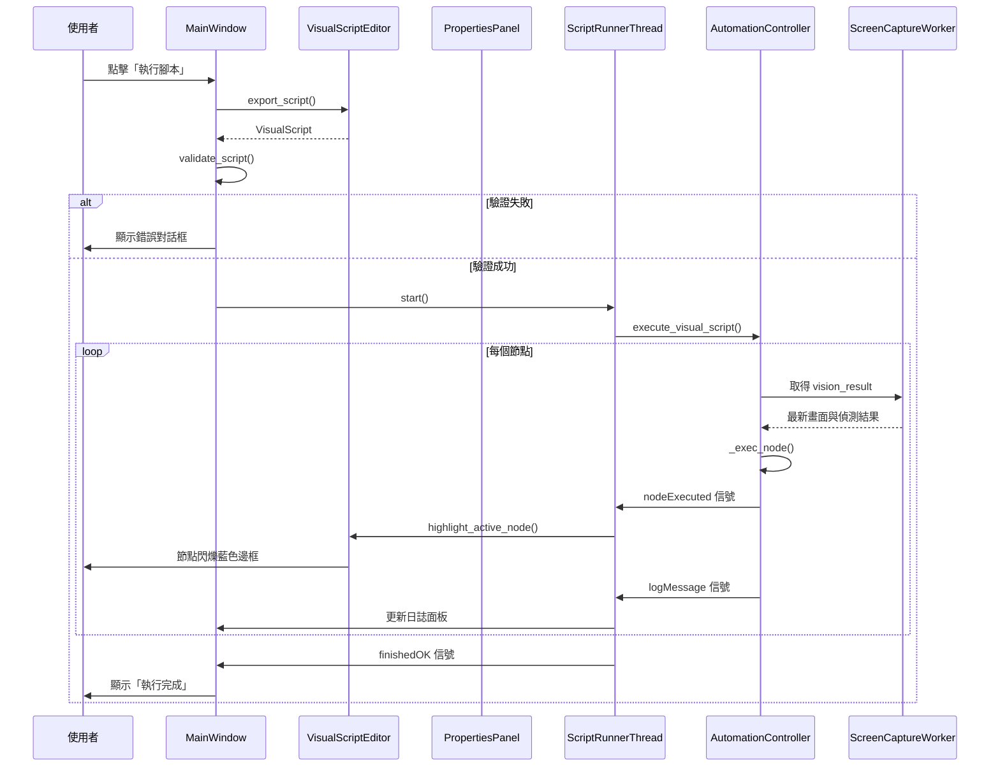

I have created the following plan after thorough exploration and analysis of the codebase. Follow the below plan verbatim. Trust the files and references. Do not re-verify what's written in the plan. Explore only when absolutely necessary. First implement all the proposed file changes and then I'll review all the changes together at the end.

## 觀察重點

您的遊戲自動化工具已具備完整的視覺化腳本編輯、模板匹配、節點連接等核心功能。但從程式碼分析發現：腳本執行會阻塞 GUI 主執行緒、參數編輯需手動輸入 JSON 格式、缺乏即時預覽與視覺化除錯工具、錯誤處理不夠友善、部分功能按鈕已停用（錄製、單步執行、暫停）。這些因素導致操作流暢度不佳，學習曲線較陡峭。

## 改善策略

採用「漸進式優化」策略，優先解決最影響使用者體驗的問題：將腳本執行移至背景執行緒、簡化參數編輯介面、增強視覺回饋、完善錯誤處理、補充缺失功能。透過改善 `file:game_automation/ui/main_window.py`、`file:game_automation/ui/visual_script_editor.py`、`file:game_automation/ui/widgets.py` 的互動設計，並在 `file:game_automation/core/automation.py` 加入更細緻的執行控制，讓工具更直覺、更人性化。

---

## 實作指引

### 第一階段：執行流程優化（最高優先）

#### 1.1 非阻塞式腳本執行
**目標：** 解決腳本執行時 GUI 凍結的問題

- 在 `file:game_automation/ui/main_window.py` 的 `_run_current_script` 方法中，已使用 `ScriptRunnerThread` 執行腳本
- 但需要加入執行狀態管理：
  - 新增「停止執行」按鈕（目前只有開始按鈕）
  - 在 `ScriptRunnerThread` 加入 `stop()` 方法與 `_should_stop` 旗標
  - 在 `AutomationController.execute_visual_script` 的主迴圈中檢查停止旗標
  - 執行期間停用「執行腳本」按鈕，啟用「停止」按鈕
  - 執行完成或停止後恢復按鈕狀態

#### 1.2 執行進度視覺化
**目標：** 讓使用者清楚看到腳本執行到哪個節點

- 在 `file:game_automation/ui/visual_script_editor.py` 的 `VisualNodeItem` 類別中：
  - 新增 `execution_state` 屬性（idle/running/success/failed）
  - 在 `paint` 方法中根據狀態繪製不同邊框顏色：
    - 執行中：藍色閃爍邊框
    - 成功：綠色邊框（短暫顯示）
    - 失敗：紅色邊框（持續顯示）
  - 新增 `set_execution_state` 方法供外部更新狀態
- 在 `MainWindow._run_current_script` 中：
  - 連接 `runner.nodeExecuted` 信號到編輯器的節點狀態更新方法
  - 執行完成後清除所有節點的執行狀態

#### 1.3 執行日誌面板
**目標：** 提供詳細的執行記錄與錯誤訊息

- 在 `file:game_automation/ui/main_window.py` 的 `_build_ui` 方法中：
  - 在主視窗底部新增可摺疊的日誌面板（`QTextEdit`，唯讀）
  - 新增「清除日誌」按鈕
- 在 `AutomationController._exec_node` 中：
  - 每個節點執行前後記錄時間戳、節點 ID、節點類型
  - 成功時記錄執行結果（例如：點擊座標、找到的圖片位置）
  - 失敗時記錄詳細錯誤原因（例如：找不到模板、座標超出範圍）
- 透過 `ScriptRunnerThread` 的新信號 `logMessage(str)` 將日誌傳送到 GUI

---

### 第二階段：參數編輯簡化（高優先）

#### 2.1 智慧型參數表單
**目標：** 取代手動輸入 JSON，改用視覺化表單

- 在 `file:game_automation/ui/main_window.py` 的 `PropertiesPanel` 類別中：
  - 針對 `click` 節點：
    - 將 `label` 參數改為下拉選單（從 `TARGET_DEFINITIONS` 和 `_templates` 載入）
    - 新增「從畫面選取」按鈕，點擊後進入截圖選取模式
    - `button` 參數改為單選按鈕（左鍵/右鍵）
    - `duration` 參數改為滑桿（0-2 秒）
  - 針對 `condition` 節點：
    - `mode` 改為單選按鈕（label/color）
    - 根據 `mode` 動態顯示對應參數表單
    - `min_confidence` 改為滑桿（0.0-1.0）
    - 顏色範圍參數改為顏色選擇器
  - 針對 `loop` 節點：
    - `count` 改為數字輸入框（帶上下箭頭）
    - 視覺化顯示迴圈體與迴圈後的連接
  - 針對 `find_image` 和 `verify_image_color` 節點：
    - 新增「上傳圖片」和「從剪貼簿貼上」按鈕（已部分實作）
    - 顯示模板圖片縮圖預覽
    - `confidence` 改為滑桿

#### 2.2 即時參數驗證
**目標：** 在使用者輸入時立即檢查參數有效性

- 在 `PropertiesPanel._update_param` 方法中：
  - 檢查必填參數是否已填寫
  - 檢查數值範圍是否合法
  - 檢查模板名稱是否存在於 `TARGET_DEFINITIONS`
  - 無效時在參數欄位旁顯示紅色警告圖示與提示文字
- 在 `MainWindow._run_current_script` 執行前：
  - 遍歷所有節點，檢查參數完整性
  - 若有無效參數，彈出對話框列出所有問題節點
  - 使用者確認後才執行或取消執行

#### 2.3 參數預設值與範本
**目標：** 減少重複設定相同參數

- 在 `file:game_automation/ui/widgets.py` 的 `ResourceSidebar` 中：
  - 新增「參數預設值」設定對話框
  - 允許使用者為每種節點類型設定預設參數
  - 儲存到 `default_params.json`
- 在 `VisualScriptEditor.add_node` 中：
  - 建立新節點時自動套用預設參數
  - 使用者可在屬性面板中修改

---

### 第三階段：視覺化除錯工具（中優先）

#### 3.1 即時畫面預覽
**目標：** 在編輯器中顯示當前截圖與偵測結果

- 在 `file:game_automation/ui/main_window.py` 中：
  - 新增「預覽」面板（可停靠或浮動視窗）
  - 顯示最新的 `_latest_vision_result["frame"]`
  - 在畫面上繪製所有偵測到的目標邊界框與標籤
  - 點擊邊界框時自動填入對應的 `label` 到選中節點的參數
- 在 `_on_frame_ui` 方法中：
  - 更新預覽面板的畫面（使用 `QLabel` 或 `QGraphicsView`）
  - 新增「凍結畫面」按鈕，方便使用者仔細檢視

#### 3.2 單步執行與斷點
**目標：** 實作目前停用的單步執行功能

- 在 `file:game_automation/core/automation.py` 的 `AutomationController` 中：
  - 新增 `execution_mode` 屬性（continuous/step/paused）
  - 新增 `breakpoints` 集合（儲存節點 ID）
  - 在 `execute_visual_script` 的主迴圈中：
    - 若 `execution_mode == "step"`，每執行一個節點後暫停
    - 若當前節點在 `breakpoints` 中，暫停執行
    - 暫停時發送 `executionPaused` 信號
- 在 `MainWindow` 中：
  - 啟用「單步執行」、「暫停」、「繼續」按鈕
  - 在 `VisualScriptEditor` 的節點右鍵選單中新增「設定/移除斷點」
  - 斷點節點以紅點標記

#### 3.3 變數監視器
**目標：** 顯示執行過程中的關鍵資訊

- 在 `MainWindow` 中新增「變數」面板（`QTableWidget`）：
  - 顯示當前 `vision_result` 的內容（found_targets 列表）
  - 顯示迴圈計數器狀態（`_loop_counters`）
  - 顯示上一個節點的執行結果
- 在 `ScriptRunnerThread` 中：
  - 新增 `variableUpdated` 信號，傳遞變數名稱與值
  - 在每個節點執行後發送更新

---

### 第四階段：錯誤處理與使用者引導（中優先）

#### 4.1 友善的錯誤訊息
**目標：** 將技術性錯誤轉換為使用者可理解的說明

- 在 `AutomationController._exec_node` 的 `except` 區塊中：
  - 捕捉具體的異常類型（`FileNotFoundError`、`ValueError` 等）
  - 根據異常類型產生對應的中文錯誤訊息
  - 例如：「找不到模板圖片 'START_BUTTON'，請檢查 resources.json 中的路徑是否正確」
- 在 `MainWindow._run_current_script` 的 `runner.failed` 信號處理中：
  - 彈出對話框顯示詳細錯誤訊息
  - 提供「查看日誌」按鈕，自動展開日誌面板並捲動到錯誤位置

#### 4.2 新手引導與提示
**目標：** 降低學習曲線

- 在 `MainWindow` 首次啟動時：
  - 顯示歡迎對話框，簡介主要功能
  - 提供「快速入門教學」按鈕，載入範例腳本
- 在編輯器中新增工具提示：
  - 滑鼠懸停在節點上時顯示節點類型說明與參數範例
  - 滑鼠懸停在連接線上時顯示執行順序
- 在工具列按鈕上新增詳細的工具提示文字

#### 4.3 腳本驗證與建議
**目標：** 在執行前發現潛在問題

- 在 `VisualScriptEditor` 中新增 `validate_script` 方法：
  - 檢查是否有孤立節點（沒有連接的節點）
  - 檢查條件節點是否設定了 `next_true` 和 `next_false`
  - 檢查迴圈節點是否設定了 `next_body` 和 `next_after`
  - 檢查是否有循環連接（可能導致無限迴圈）
  - 檢查模板名稱是否存在
- 在 `MainWindow` 中新增「驗證腳本」按鈕：
  - 執行驗證並顯示結果對話框
  - 列出所有警告與錯誤
  - 點擊問題項目時自動選中對應節點

---

### 第五階段：新增實用功能（低優先）

#### 5.1 腳本錄製功能
**目標：** 實作目前停用的錄製模式

- 在 `MainWindow` 中新增錄製狀態管理：
  - 點擊「錄製」按鈕後進入錄製模式
  - 監聽全域滑鼠與鍵盤事件（使用 `pynput` 或 `pyautogui`）
  - 將使用者操作轉換為對應的節點（click/key/sleep）
  - 自動計算操作間的時間間隔，插入 `sleep` 節點
  - 點擊「停止錄製」後將節點序列加入編輯器
- 錄製時在預覽面板中顯示紅色錄製指示器

#### 5.2 批次執行與排程
**目標：** 支援多腳本連續執行

- 在 `ResourceSidebar` 中新增「執行佇列」標籤頁：
  - 允許使用者拖曳腳本到佇列中
  - 設定每個腳本的執行次數與間隔時間
  - 新增「開始批次執行」按鈕
- 在 `MainWindow` 中新增 `BatchExecutor` 類別：
  - 依序執行佇列中的腳本
  - 顯示整體進度條與當前執行的腳本名稱

#### 5.3 腳本匯入/匯出與分享
**目標：** 方便使用者備份與分享腳本

- 在 `MainWindow` 的選單列中新增「匯出腳本套件」功能：
  - 將選中的腳本與相關模板圖片打包成 ZIP 檔案
  - 包含 `manifest.json` 描述腳本資訊
- 新增「匯入腳本套件」功能：
  - 解壓縮 ZIP 檔案
  - 自動註冊模板圖片到 `resources.json`
  - 將腳本加入 `visual_scripts.json`

#### 5.4 效能監控與優化建議
**目標：** 幫助使用者優化腳本效能

- 在執行日誌中記錄每個節點的執行時間
- 執行完成後顯示效能報告：
  - 總執行時間
  - 最慢的 5 個節點
  - 建議優化方向（例如：減少不必要的 `sleep`、調整模板匹配閾值）

---

## 架構圖

---

## 關鍵檔案與修改重點

| 檔案 | 修改重點 | 優先級 |
|------|---------|--------|
| `file:game_automation/ui/main_window.py` | 新增停止按鈕、日誌面板、預覽面板、驗證邏輯 | 高 |
| `file:game_automation/ui/visual_script_editor.py` | 節點執行狀態視覺化、斷點標記、驗證方法 | 高 |
| `file:game_automation/ui/widgets.py` | PropertiesPanel 改用視覺化表單、參數驗證 | 高 |
| `file:game_automation/core/automation.py` | 停止旗標、單步執行模式、詳細錯誤訊息 | 中 |
| `file:game_automation/core/actions.py` | 新增 `execution_state` 欄位到 `VisualNode` | 低 |

---

## 建議的實作順序

1. **第一週：** 執行流程優化（1.1-1.3）- 解決最嚴重的 UX 問題
2. **第二週：** 參數編輯簡化（2.1-2.3）- 大幅降低使用門檻
3. **第三週：** 視覺化除錯工具（3.1-3.2）- 提升開發效率
4. **第四週：** 錯誤處理與引導（4.1-4.3）- 完善使用者體驗
5. **後續迭代：** 新增功能（5.1-5.4）- 根據使用者回饋決定優先順序

---

## 額外建議功能

### 快捷鍵系統
- `Ctrl+R`：執行當前腳本
- `Ctrl+Shift+R`：停止執行
- `F5`：單步執行下一個節點
- `F9`：設定/移除斷點
- `Ctrl+Shift+V`：驗證腳本
- `Ctrl+Shift+L`：開啟/關閉日誌面板

### 主題與外觀
- 在 `file:game_automation/ui/themes.py` 中新增深色主題選項
- 允許使用者自訂節點顏色與字體大小
- 新增「緊湊模式」，減少節點間距以容納更多節點

### 協作功能
- 腳本版本控制（整合 Git）
- 腳本註解與文件產生器
- 團隊共享的模板庫

### 智慧輔助
- 根據截圖自動建議可用的模板
- 分析腳本執行歷史，推薦優化方案
- 自動偵測重複的節點序列，建議建立節點模板